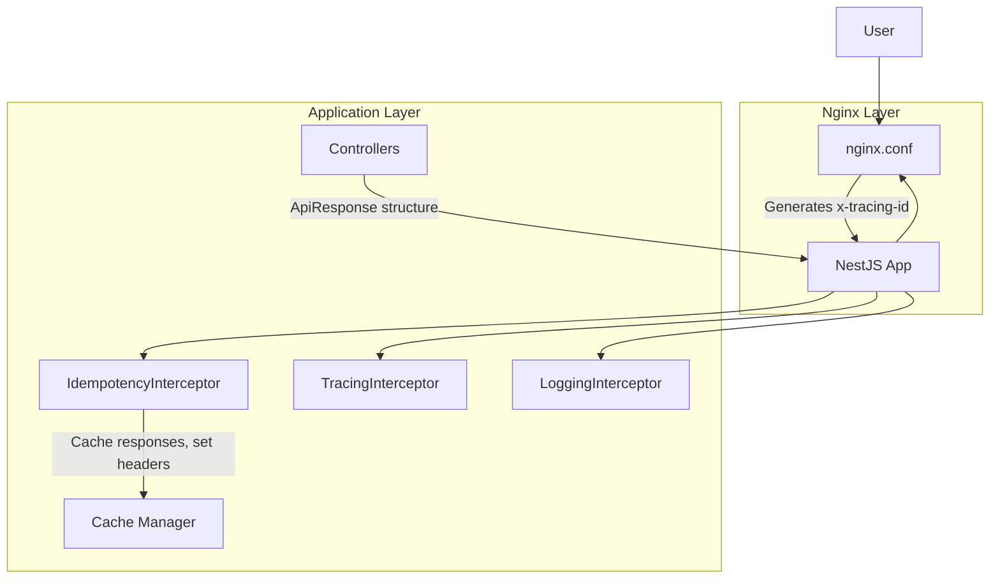

## Requirements

- Implement idempotency with input header as [x-idempotency-key]. This idempotency will be applied only on the routes that have an idempotency decorator.
- In the response headers, pass [x-idempotency-key] back.
- Also, add [x-idempotency-status] value can be either "Original" (first request) or "FromCache" (cached response).
- If the user is not sending an idempotency key, then we will generate one using the request details, which is a hash of ip+url+body+headers[bearerToken,x-workspace,x-channel], etc.

- Implement e2e tracing, where tracing ID will come in the header[x-tracing-id] from nginx.

- Every entry, exit, error/exception do log for each endpoint or action. Also log telementry data such as Request processing time, Cache hits and misses

- You can use any industry-standard packages to avoid reinventing the wheel.

- response structure should be
{
  status: "SUCCESS/FAILED/TIMEDOUT",
  data: {..},
}

- Remove sensitive information from logs like ['authorization',
      'x-api-key',
      'api-key',
      'cookie',
      'set-cookie',
      'token', etc]

---

## Solution Architecture

### Overview
This solution implements:
- **Idempotency**: Custom decorator and interceptor, caches responses, generates keys if not provided, sets headers.
- **Tracing**: Nginx reverse proxy generates and forwards `x-tracing-id` to the app; TracingInterceptor logs and propagates traceId.
- **Logging & Telemetry**: LoggingInterceptor logs entry, exit, error, timeout, request processing time, cache hits/misses, and sanitizes sensitive headers.
- **Response Structure**: All endpoints return `{ status: 'SUCCESS' | 'FAILED' | 'TIMEDOUT', data, ... }`.
- **Sensitive Data Removal**: Logs sanitize headers like authorization, api-key, cookie, token, etc.

### Architecture Diagram

### Key Files
- `nginx.conf`: Nginx reverse proxy, generates/forwards `x-tracing-id`.
- `src/common/idempotency.interceptor.ts`: Handles idempotency logic, caching, header management.
- `src/common/tracing.interceptor.ts`: Extracts and logs `x-tracing-id`.
- `src/common/logging.interceptor.ts`: Logs entry/exit/error/timeout, telemetry, sanitizes sensitive headers.
- `src/sample/sample.controller.ts`: Sample endpoints, standardized response.
- `docker-compose.yml`, `Dockerfile`: Container orchestration and build.

### How It Works
1. Requests go through Nginx, which ensures every request has a `x-tracing-id` header.
2. NestJS interceptors handle idempotency, tracing, and logging for each request.
3. Idempotency is applied only to decorated routes; cache is used for retries/timeouts.
4. Logs are structured, include traceId, and redact sensitive info.
5. All responses follow the standard ApiResponse format.

---

