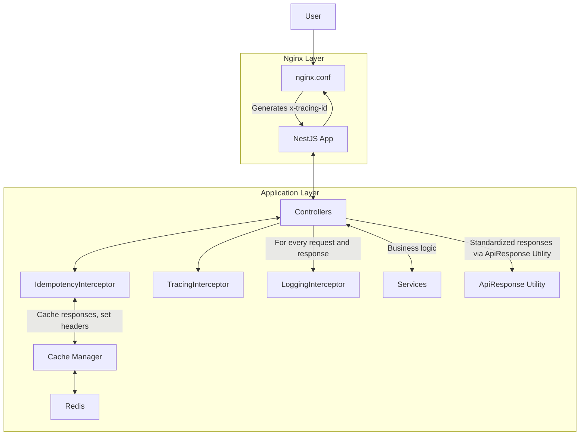

## Requirements

- Implement idempotency with input header as [x-idempotency-key]. This idempotency will be applied only on the routes that have an idempotency decorator.
- In the response headers, pass [x-idempotency-key] back.
- Also, add [x-idempotency-status] value can be either "Original" (first request) or "FromCache" (cached response).
- If the user is not sending an idempotency key, then we will generate one using the request details, which is a hash of ip+url+body+headers[bearerToken,x-workspace,x-channel], etc.

- Implement e2e tracing, where tracing ID will come in the header[x-tracing-id] from nginx.

- Every entry, exit, error/exception do log for each endpoint or action. Also log telementry data such as Request processing time, Cache hits and misses

- You can use any industry-standard packages to avoid reinventing the wheel.

- response structure should be
{
  status: "SUCCESS/FAILED/TIMEDOUT",
  data: {..},
}

- Remove sensitive information from logs like ['authorization',
      'x-api-key',
      'api-key',
      'cookie',
      'set-cookie',
      'token', etc]

---

## Solution Architecture

### Overview
This solution implements:
- **Idempotency**: Custom decorator and interceptor, caches responses, generates keys if not provided, sets headers.
- **Tracing**: Nginx reverse proxy generates and forwards `x-tracing-id` to the app; TracingInterceptor logs and propagates traceId.
- **Logging & Telemetry**: LoggingInterceptor logs entry, exit, error, timeout, request processing time, cache hits/misses, and sanitizes sensitive headers. Log tags now reflect actual response status (`SUCCESS`, `FAILED`, `TIMEDOUT`).
- **Response Structure**: All endpoints use a shared utility (`buildApiResponse`) for standardized responses: `{ status: 'SUCCESS' | 'FAILED' | 'TIMEDOUT', data, ... }`.
- **Sensitive Data Removal**: Logs sanitize headers like authorization, api-key, cookie, token, etc.
- **Controller/Service Refactor**: Controllers and services use the shared response builder, eliminating duplication and ensuring consistency.

### Redis Details
- **Redis** is used as the backend for the cache manager, enabling fast and reliable idempotency and response caching.
- The Redis service is defined in `docker-compose.yml` and runs as a container alongside the NestJS app.
- The idempotency interceptor interacts with Redis to store and retrieve cached responses using generated idempotency keys.
- Redis ensures that repeated requests with the same idempotency key return the cached response, supporting robust retry and timeout logic.

### Architecture Diagram

### Key Files
- `nginx.conf`: Nginx reverse proxy, generates/forwards `x-tracing-id`.
- `src/common/idempotency.interceptor.ts`: Handles idempotency logic, caching, header management.
- `src/common/tracing.interceptor.ts`: Extracts and logs `x-tracing-id`.
- `src/common/logging.interceptor.ts`: Logs entry/exit/error/timeout, telemetry, sanitizes sensitive headers, tags reflect response status.
- `src/common/api-response.util.ts`: Shared utility for standardized API responses.
- `src/sample/sample.controller.ts`: Sample endpoints, uses shared response builder.
- `src/sample/sample.service.ts`: Business logic, uses shared response builder.
- `docker-compose.yml`, `Dockerfile`: Container orchestration and build.

### How It Works
1. Requests go through Nginx, which ensures every request has a `x-tracing-id` header.
2. NestJS interceptors handle idempotency, tracing, and logging for each request.
3. **Redis** is used by the idempotency interceptor to cache responses and serve repeated requests efficiently.
4. Idempotency is applied only to decorated routes; cache is used for retries/timeouts.
5. Logs are structured, include traceId, redact sensitive info, and tag responses by status.
6. All responses use the shared ApiResponse utility for consistency.
7. Controllers and services are refactored to avoid duplication and ensure maintainability.

---

### TODO (24th September 2025)

- Make sure nginx config logging format consistent with laravel app. Like Workspace, workspace env, hostname, request id (New to add) etc. Also it should not log twice.
- Use fastest hash algorithm for generating idempotency key if not provided.
- Remove cache data after first successful response or keep 5 min expiry.